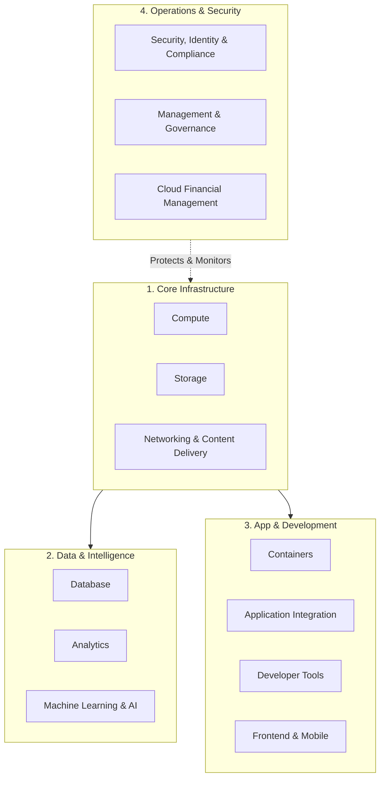
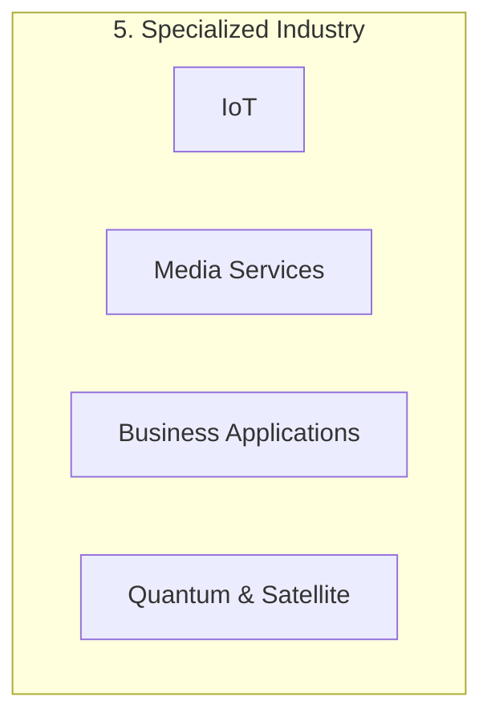

# The 5 Pillars of AWS

This diagram separates the foundation (Infrastructure) from the higher-level intelligence (Data/ML) and the operational tools (Management/Dev).

## Segregated Breakdown Tables

Here is how you can divide these components separately for your training modules:

#### Group 1: The Building Blocks (IaaS)

These are the foundational services required for every cloud architecture.
| Category | Key Services | Focus |
| :--- | :--- | :--- |
| **Compute** | EC2, Lambda, AutoScaling, Fargate | Processing power and server management. |
| **Storage** | S3, EBS, EFS, Glacier | Data persistence and backups. |
| **Networking** | VPC, Route53, CloudFront, ALB | Connectivity, DNS, and traffic routing. |

#### Group 2: Data & Analytics (Big Data)

These services manage the flow, storage, and interpretation of information.
| Category | Key Services | Focus |
| :--- | :--- | :--- |
| **Database** | RDS, DynamoDB, Aurora, Redshift | Relational (SQL) and NoSQL data storage. |
| **Analytics** | Athena, Glue, EMR, Kinesis | Processing large datasets and real-time streams. |
| **Machine Learning** | SageMaker, Bedrock, Rekognition | AI models, Generative AI, and computer vision. |

#### Group 3: App Modernization & DevOps

Tools for developers to build, ship, and run modern applications.
| Category | Key Services | Focus |
| :--- | :--- | :--- |
| **Containers** | EKS, ECS, ECR | Orchestrating Docker and Kubernetes. |
| **Dev Tools** | CodePipeline, CodeBuild, X-Ray | CI/CD pipelines and debugging code. |
| **Integration** | SQS, SNS, EventBridge | Decoupling services via messaging and events. |

