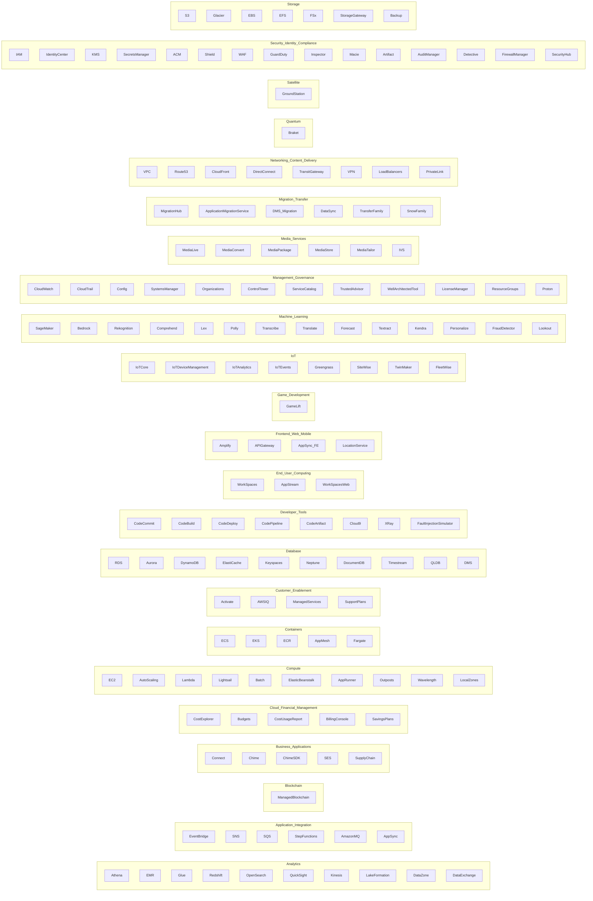

## ☁️ AWS Services by Category

Click on a category to see the included services.

📊 Analytics

<ul>
<li>Athena</li>
<li>EMR</li>
<li>Glue</li>
<li>Redshift</li>
<li>OpenSearch</li>
<li>QuickSight</li>
<li>Kinesis</li>
<li>LakeFormation</li>
<li>DataZone</li>
<li>DataExchange</li>
</ul>

🔄 Application Integration

<ul>
<li>EventBridge</li>
<li>SNS</li>
<li>SQS</li>
<li>StepFunctions</li>
<li>AmazonMQ</li>
<li>AppSync</li>
</ul>

⛓️ Blockchain

<ul>
<li>ManagedBlockchain</li>
</ul>

💼 Business Applications

<ul>
<li>Connect</li>
<li>Chime</li>
<li>ChimeSDK</li>
<li>SES</li>
<li>SupplyChain</li>
</ul>

💰 Cloud Financial Management

<ul>
<li>CostExplorer</li>
<li>Budgets</li>
<li>CostUsageReport</li>
<li>BillingConsole</li>
<li>SavingsPlans</li>
</ul>

💻 Compute

<ul>
<li>EC2</li>
<li>AutoScaling</li>
<li>Lambda</li>
<li>Lightsail</li>
<li>Batch</li>
<li>ElasticBeanstalk</li>
<li>AppRunner</li>
<li>Outposts</li>
<li>Wavelength</li>
<li>LocalZones</li>
</ul>

📦 Containers

<ul>
<li>ECS</li>
<li>EKS</li>
<li>ECR</li>
<li>AppMesh</li>
<li>Fargate</li>
</ul>

🤝 Customer Enablement

<ul>
<li>Activate</li>
<li>AWSIQ</li>
<li>ManagedServices</li>
<li>SupportPlans</li>
</ul>

🗄️ Database

<ul>
<li>RDS</li>
<li>Aurora</li>
<li>DynamoDB</li>
<li>ElastiCache</li>
<li>Keyspaces</li>
<li>Neptune</li>
<li>DocumentDB</li>
<li>Timestream</li>
<li>QLDB</li>
<li>DMS</li>
</ul>

🛠️ Developer Tools

<ul>
<li>CodeCommit</li>
<li>CodeBuild</li>
<li>CodeDeploy</li>
<li>CodePipeline</li>
<li>CodeArtifact</li>
<li>Cloud9</li>
<li>XRay</li>
<li>FaultInjectionSimulator</li>
</ul>

🖥️ End User Computing

<ul>
<li>WorkSpaces</li>
<li>AppStream</li>
<li>WorkSpacesWeb</li>
</ul>

📱 Frontend Web & Mobile

<ul>
<li>Amplify</li>
<li>APIGateway</li>
<li>AppSync_FE</li>
<li>LocationService</li>
</ul>

🎮 Game Development

<ul>
<li>GameLift</li>
</ul>

🌐 Internet of Things (IoT)

<ul>
<li>IoTCore</li>
<li>IoTDeviceManagement</li>
<li>IoTAnalytics</li>
<li>IoTEvents</li>
<li>Greengrass</li>
<li>SiteWise</li>
<li>TwinMaker</li>
<li>FleetWise</li>
</ul>

🤖 Machine Learning

<ul>
<li>SageMaker</li>
<li>Bedrock</li>
<li>Rekognition</li>
<li>Comprehend</li>
<li>Lex</li>
<li>Polly</li>
<li>Transcribe</li>
<li>Translate</li>
<li>Forecast</li>
<li>Textract</li>
<li>Kendra</li>
<li>Personalize</li>
<li>FraudDetector</li>
<li>Lookout</li>
</ul>

⚙️ Management & Governance

<ul>
<li>CloudWatch</li>
<li>CloudTrail</li>
<li>Config</li>
<li>SystemsManager</li>
<li>Organizations</li>
<li>ControlTower</li>
<li>ServiceCatalog</li>
<li>TrustedAdvisor</li>
<li>WellArchitectedTool</li>
<li>LicenseManager</li>
<li>ResourceGroups</li>
<li>Proton</li>
</ul>

🎬 Media Services

<ul>
<li>MediaLive</li>
<li>MediaConvert</li>
<li>MediaPackage</li>
<li>MediaStore</li>
<li>MediaTailor</li>
<li>IVS</li>
</ul>

🚚 Migration & Transfer

<ul>
<li>MigrationHub</li>
<li>ApplicationMigrationService</li>
<li>DMS_Migration</li>
<li>DataSync</li>
<li>TransferFamily</li>
<li>SnowFamily</li>
</ul>

📡 Networking & Content Delivery

<ul>
<li>VPC</li>
<li>Route53</li>
<li>CloudFront</li>
<li>DirectConnect</li>
<li>TransitGateway</li>
<li>VPN</li>
<li>LoadBalancers</li>
<li>PrivateLink</li>
</ul>

⚛️ Quantum Technologies

<ul>
<li>Braket</li>
</ul>

🛰️ Satellite

<ul>
<li>GroundStation</li>
</ul>

🛡️ Security, Identity & Compliance

<ul>
<li>IAM</li>
<li>IdentityCenter</li>
<li>KMS</li>
<li>SecretsManager</li>
<li>ACM</li>
<li>Shield</li>
<li>WAF</li>
<li>GuardDuty</li>
<li>Inspector</li>
<li>Macie</li>
<li>Artifact</li>
<li>AuditManager</li>
<li>Detective</li>
<li>FirewallManager</li>
<li>SecurityHub</li>
</ul>

💾 Storage

<ul>
<li>S3</li>
<li>Glacier</li>
<li>EBS</li>
<li>EFS</li>
<li>FSx</li>
<li>StorageGateway</li>
<li>Backup</li>
</ul>

---

