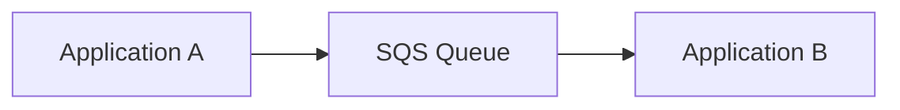
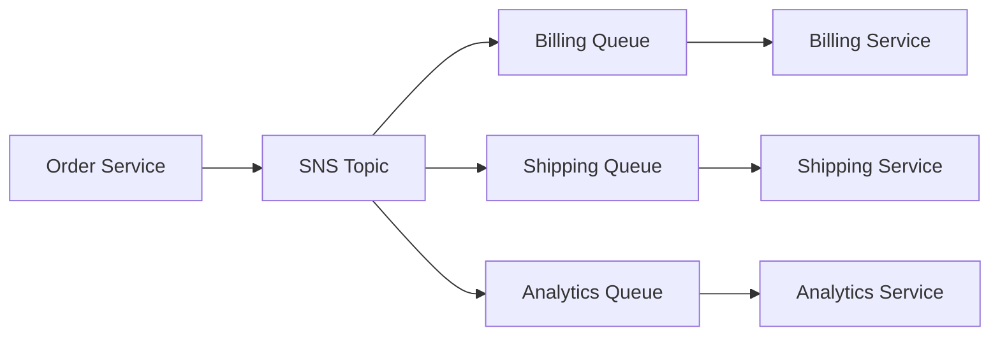
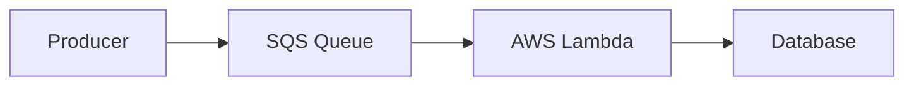
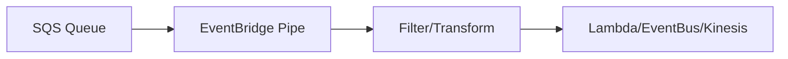
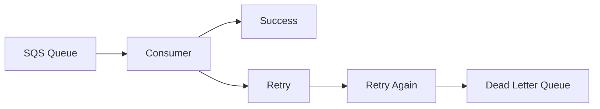
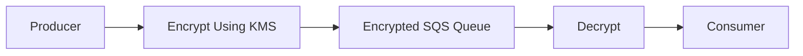
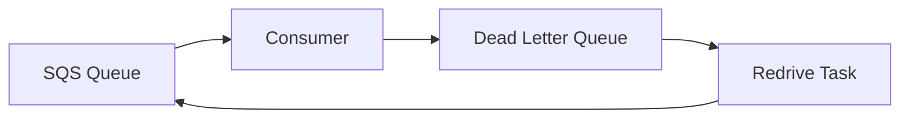
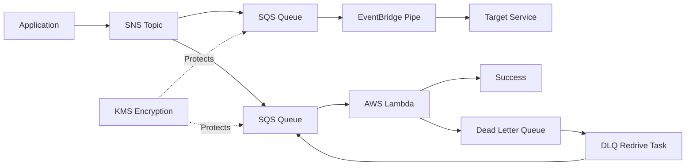

# Understanding AWS SQS

Amazon SQS (Simple Queue Service) is a fully managed message queue service. Think of it as a **buffer or waiting room** between applications.

Instead of Application A directly calling Application B, A places a message into SQS. B processes it when ready.

Benefits:

* Decouples applications
* Handles traffic spikes
* Improves reliability
* Prevents message loss
* Enables asynchronous processing

Basic flow:

---

## SNS Subscriptions with SQS

Amazon SNS (Simple Notification Service) is a **publish-subscribe service**.

When one message needs to reach multiple systems, SNS publishes the message and sends copies to all subscribed endpoints, including SQS queues.

Example:

* Order created
* Billing service needs it
* Shipping service needs it
* Analytics service needs it

SNS sends one message to multiple SQS queues.

### Why use it?

* Fan-out architecture
* Loose coupling
* Easy addition of new consumers

### Flow

### Key Point

SNS pushes messages to SQS. Each queue receives its own copy and processes independently.

---

## Lambda Triggers

AWS Lambda can automatically poll an SQS queue.

When messages arrive:

1. Lambda reads messages.
2. Processes them.
3. Deletes successful messages.

No server management is required.

### Why use it?

* Event-driven architecture
* Automatic scaling
* Pay only when processing

### Flow

### What happens on failure?

If Lambda fails:

* Message remains in queue.
* SQS retries processing.
* After retry limit is reached, message can move to a DLQ.

---

## EventBridge Pipes

EventBridge Pipes provide a managed connection between a source and target.

Instead of writing Lambda code just to move messages, Pipes can:

* Read from SQS
* Filter messages
* Transform payloads
* Send to target services

### Why use it?

* Less code
* Easier integrations
* Built-in filtering and transformation

### Flow

### Example

A queue contains all orders.

Pipe filters:

* Only orders above ₹10,000

Those messages are forwarded to another service.

---

## Dead-Letter Queue (DLQ)

A Dead-Letter Queue stores messages that repeatedly fail processing.

Without a DLQ:

* Failed messages keep retrying forever.
* Troubleshooting becomes difficult.

With a DLQ:

* Problematic messages are isolated.
* Normal processing continues.

### Why use it?

* Error investigation
* Prevent processing blockage
* Preserve failed messages

### Flow

### Example

A message contains invalid JSON.

Consumer fails 5 times.

After reaching the configured **maxReceiveCount**, SQS moves it to the DLQ.

---

## Encryption

Encryption protects messages from unauthorized access.

AWS supports:

### Server-Side Encryption (SSE)

Messages are encrypted before storage.

AWS can use:

* AWS managed keys
* Customer managed KMS keys

### Why use it?

* Data protection
* Compliance requirements
* Secure storage

### Flow

### Important

Encryption protects data **at rest**.

AWS automatically decrypts messages for authorized consumers.

---

## DLQ Redrive Tasks

After fixing the issue that caused failures, you usually want to process DLQ messages again.

AWS provides **DLQ Redrive**.

Instead of manually copying messages:

1. Select DLQ.
2. Start redrive task.
3. Messages move back to source queue (or another queue).

### Why use it?

* Faster recovery
* No custom scripts
* Controlled replay of failed messages

### Flow

### Example

1. Database outage causes processing failures.
2. Messages accumulate in DLQ.
3. Database is fixed.
4. Redrive task sends messages back.
5. Processing resumes successfully.

---

# Summary Comparison

| Feature           | Purpose                                 | Common Use Case                      | Code Required |
| ----------------- | --------------------------------------- | ------------------------------------ | ------------- |
| SQS               | Reliable message buffering              | Decouple applications                | No            |
| SNS → SQS         | Fan-out messaging                       | One event to many consumers          | No            |
| Lambda Trigger    | Event-driven processing                 | Process queue messages automatically | Minimal       |
| EventBridge Pipes | Connect source to target with filtering | Routing and transformation           | No            |
| DLQ               | Store failed messages                   | Troubleshooting and recovery         | No            |
| Encryption        | Protect stored messages                 | Security and compliance              | No            |
| DLQ Redrive       | Replay failed messages                  | Recover after issue resolution       | No            |

### Architecture Putting Everything Together

This pattern is one of the most common event-driven architectures in AWS: **SNS distributes events, SQS buffers them, Lambda or EventBridge Pipes process them, DLQs capture failures, Redrive restores failed messages, and KMS encryption protects the data.**
