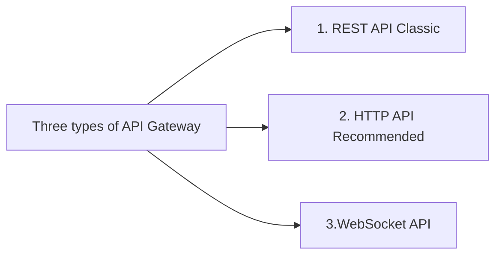
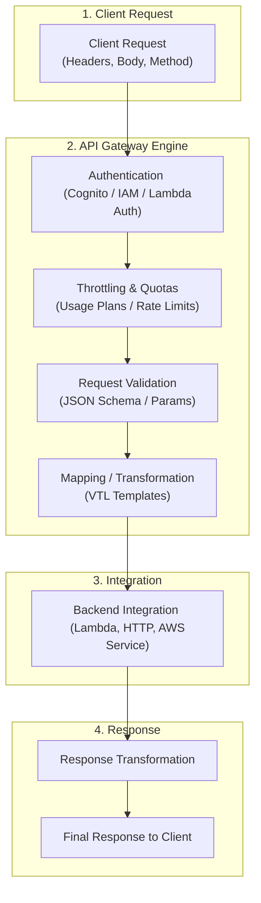

# 1. What is API Gateway? 

**Amazon API Gateway** is a **fully managed AWS service** that allows you to **create, publish, secure, monitor, and manage APIs** at any scale.

In simple words:

> API Gateway acts as a **front door** for applications to access backend services like **Lambda, EC2, ECS, EKS, or any HTTP endpoint**.

It handles:

* Request receiving
* Authentication & authorization
* Traffic management
* Security
* Monitoring
* Cost control

---

# 2. Why API Gateway Exists 

Without API Gateway:

* Clients talk directly to backend services
* You must manage:

  * Authentication
  * Rate limiting
  * DDoS protection
  * API versions
  * SSL termination
  * Logging
  * Scaling

With API Gateway:
All this is **abstracted and managed by AWS**

---

# 3. Uses / Real-World Scenarios

### Common use cases

* Expose **REST APIs** to web/mobile apps
* Trigger **AWS Lambda** functions
* Secure backend services from the internet
* Create **public APIs** for external customers
* Act as a **proxy** to private services
* Webhook receiver (Slack, GitHub, Stripe, etc.)

### Example

```
Mobile App → API Gateway → Lambda → DynamoDB
```

---

# 4. Types of API Gateways in AWS



---

## 4.1 REST API (Classic)

### What it is

* Feature-rich, older API Gateway type
* Supports RESTful semantics

### Features

* Request/response transformation
* API keys
* Usage plans
* Caching
* WAF integration
* Fine-grained authorization

### Use when:

* You need **complex API management**
* Legacy systems
* Heavy transformations

### Downside

* Higher cost
* Higher latency

---

## 4.2 HTTP API (Recommended for most cases)

### What it is

* Lightweight, faster, cheaper version

### Features

* JWT authorizers
* Lambda & HTTP backends
* CORS
* Custom domains
* IAM auth

### Use when:

* Microservices
* Public APIs
* Mobile / web backends

### Why AWS recommends it

* ~70% cheaper
* Lower latency
* Simpler config

---

## 4.3 WebSocket API

### What it is

* Stateful, bidirectional communication

### Features

* Real-time messaging
* Persistent connections

### Use when:

* Chat apps
* Live notifications
* Gaming
* Stock tickers

---

# 5. Core Components of API Gateway

### 1. API

Top-level container (REST / HTTP / WebSocket)

### 2. Route / Resource

Defines **URL path**

```
/users
/orders/{id}
```

### 3. Method

HTTP methods:

```
GET, POST, PUT, DELETE
```

### 4. Integration

Backend target:

* Lambda
* HTTP endpoint
* AWS service

### 5. Stage

Environment:

```
dev / test / prod
```

---

# 6. How API Gateway Works (Flow)




API Gateway:

* Terminates HTTPS
* Validates request
* Applies security rules
* Sends request to backend
* Returns response

---

# 7. How It Helps Connect with Outsiders (External Users)

This is a **key concept**

### Without API Gateway

* Backend services exposed publicly
* Security risk
* Hard to control access

### With API Gateway

* Only API Gateway is public
* Backend stays private

```
Internet Users
   ↓
API Gateway (Public)
   ↓
Private VPC Resources
```

---

# 8. Networking Concepts Involved

### Public vs Private

* API Gateway can be:

  * **Public** (internet-facing)
  * **Private** (VPC-only)

### VPC Link

* Connect API Gateway → Private ALB/NLB
* Backend not exposed to internet

```
API Gateway
  ↓ VPC Link
Private ALB → EC2/EKS
```

### DNS

* Custom domain:

```
api.company.com
```

### Security Groups

* Used on backend, not API Gateway

---

# 9. Security Features

### Authentication options

* IAM authentication
* JWT authorizers
* Lambda authorizers
* Cognito user pools

### Protection

* AWS WAF
* Throttling
* Rate limiting
* API keys
* TLS encryption

---

# 10. Monitoring & Logging

### Native integrations

* CloudWatch Logs
* CloudWatch Metrics
* X-Ray tracing

You can monitor:

* Latency
* Error rates
* Throttles
* Request count

---

# 11. Cost Model (VERY IMPORTANT)

### HTTP API (Cheapest)

* Charged per **request**
* Lower price than REST API

### REST API (Expensive)

* Request count
* Data transfer
* Caching (extra)

### WebSocket

* Connection minutes
* Messages sent/received

### Cost optimization tips

* Prefer **HTTP API**
* Avoid unnecessary stages
* Enable caching only when needed
* Use throttling to prevent abuse

 You **pay only when requests come in**

---

# 12. When NOT to Use API Gateway

* Internal service-to-service calls inside VPC
* High-throughput, low-latency streaming
* Simple static content delivery

Alternatives:

* ALB
* NLB
* CloudFront

---

# 13. API Gateway vs Load Balancer

| Feature       | API Gateway | ALB           |
| ------------- | ----------- | ------------- |
| Auth          | Yes         | Limited       |
| Rate limiting | Yes         | No            |
| API keys      | Yes         | No            |
| Cost          | Per request | Per hour      |
| Use case      | Public APIs | Internal apps |

---

# 14. Typical Architecture Example

```
Client (Web/Mobile)
   ↓
CloudFront
   ↓
API Gateway
   ↓
Lambda / EKS / EC2
   ↓
Database
```

---
