# How APIgateway works in a realtime scinario.
Let's build an **E-commerce platform**.

External users (outside AWS):

* Web app
* Mobile app
* Partner systems

They need:

* Product APIs
* Order APIs
* Real-time order status updates

---

# 4.1 REST API (Classic) – How It Gets Hit

## Example

```
GET https://api.shop.com/v1/products/123
```

---

## Network Flow (Step by Step)


---

## Networking Concepts Involved

### Internet Exposure

* REST API is **public by default**
* DNS resolves: like below

```
api.shop.com → AWS API Gateway endpoint
```

### TLS :

* HTTPS termination happens **at API Gateway**
* Backend can stay private

###  VPC Connectivity :

* If backend is in VPC:

  * Uses **VPC Link**
  * Connects to **Private ALB/NLB**

```
API Gateway
   ↓ VPC Link
Private ALB → EC2 / EKS
```

---

## When REST API Is Used

* Heavy transformations
* API keys + usage plans
* Legacy systems

---

# 4.2 HTTP API – How It Gets Hit (Modern & Recommended)

## Example

```
POST https://api.shop.com/orders
```

---

## Network Flow


---

## Networking Differences vs REST API

| Area            | REST API | HTTP API     |
| --------------- | -------- | ------------ |
| Latency         | Higher   | Lower        |
| Request mapping | Complex  | Minimal      |
| Cost            | High     | ~70% cheaper |
| Data path       | Heavier  | Lightweight  |

---

## Backend in VPC (Very Common)

```
Client
   ↓
API Gateway HTTP API
   ↓ VPC Link
Private ALB
   ↓
EKS / EC2
```

**Important**:

* API Gateway **never sits inside your VPC**
* It connects **into** VPC using managed ENIs (VPC Link)

---

## Why HTTP API is Recommended

* Faster path
* Less overhead
* Ideal for microservices

---

# 4.3 WebSocket API – How It Gets Hit (Very Different)

This is **NOT request/response** like REST or HTTP.

---

## Example

```
wss://ws.shop.com
```

### Client action

```
Client opens a persistent connection
```

---

## Network Flow (Initial Handshake)

```
Client
   ↓ HTTPS (Upgrade → WebSocket)
Public Internet
   ↓
API Gateway WebSocket API
   ↓
$connect route
   ↓
Lambda (auth / register connection)
```

---

## After Connection Is Established

```
Client
   ⇄ WebSocket Connection (Persistent)
API Gateway
   ⇄ Backend (Lambda)
```

No repeated HTTP handshakes.

---

## Networking Characteristics

| Feature    | WebSocket API     |
| ---------- | ----------------- |
| Connection | Persistent        |
| Protocol   | wss://            |
| Direction  | Bi-directional    |
| Latency    | Very low          |
| Use case   | Real-time updates |

---

## Real Example: Order Status Update

```
Order packed → shipped → delivered
```

Backend sends message:

```
Lambda → API Gateway → Connected Client
```

No polling.

---

# Side-by-Side Network Comparison

```
REST / HTTP API
Client → Internet → API Gateway → Backend → Response

WebSocket API
Client ⇄ Persistent Connection ⇄ API Gateway ⇄ Backend
```


---

# Security & Network Controls (All Types)

### Common Controls

* AWS WAF
* Throttling
* Custom domains
* TLS encryption

### Private API Gateway (Advanced)

* Access only from VPC
* Uses **Interface Endpoint (PrivateLink)**

```
VPC → API Gateway (Private)
```

---

# Cost & Network Impact

| Type      | Network Pattern        | Cost Model         |
| --------- | ---------------------- | ------------------ |
| REST      | Heavy request pipeline | $$$                |
| HTTP      | Lightweight pipeline   | $                  |
| WebSocket | Long-lived connections | Connection minutes |

---

# Which One Should YOU Choose?

### Use REST API when:

* Legacy apps
* Heavy transformations

### Use HTTP API when:

* Public APIs
* Microservices
* Mobile / Web apps

### Use WebSocket API when:

* Real-time data
* Chat / notifications

# 4.3 WebSocket API – How It Gets Hit (Very Different)

This is **NOT request/response** like REST or HTTP.

---

## Example

```
wss://ws.shop.com
```

### Client action

```
Client opens a persistent connection
```

---

## Network Flow (Initial Handshake)


---

## After Connection Is Established



```mermaid
flowchart LR
    linkStyle default interpolate basis

    subgraph User_Space [External]
        C["[📱/💻] Client"]
    end

    subgraph Gateway_Layer [Management]
        AGW["[⚡] API Gateway <br/> (Connection Manager)"]
    end

    subgraph Logic_Layer [Processing]
        L["[λ] AWS Lambda <br/> (Backend)"]
    end

    %% Persistent Connection
    C <== "[🤝] Persistent WebSocket Tunnel" ==> AGW
    
    %% Bi-directional Logic
    AGW -- "1. Send Message" --> L
    L -- "2. Push Data / Callback" --> AGW


```

## No repeated HTTP handshakes.


###  a. The Difference in Two Lines

* **Standard HTTP:** It is a **"Stop-and-Go"** system where every single request requires a fresh handshake (TCP + TLS + Headers), which adds massive delay and data waste.
* **WebSockets:** It is an **"Open Tunnel"** system that uses a one-time HTTP "Upgrade" handshake to establish a permanent link, allowing data to flow instantly in both directions with zero additional setup.

---

###  b. How it Resolves the Issue

| Protocol | The Problem (Repeated Handshakes) | The Resolution (WebSockets) |
| --- | --- | --- |
| **Latency** | **High:** You wait for a 3-way handshake for every "Hi." | **Instant:** The "door" is already open; the data just walks through. |
| **Overhead** | **Large:** ~500 bytes of headers sent with every message. | **Tiny:** Only ~2 bytes of overhead per message frame. |
| **Efficiency** | **Wasteful:** CPU cycles are spent re-verifying you every second. | **Lean:** The server remembers you until you hang up. |

---

###  c. The "Restaurant" vs. "Intercom" Analogy

* **HTTP is like a Restaurant:** Every time you want a napkin, you have to catch the waiter's eye, wait for them to come over, ask, and wait for them to return.
* **WebSocket is like an Intercom:** You press the button once to open the line, and now you and the kitchen can talk back and forth instantly until you finish your meal.


---

## Networking Characteristics

| Feature    | WebSocket API     |
| ---------- | ----------------- |
| Connection | Persistent        |
| Protocol   | wss://            |
| Direction  | Bi-directional    |
| Latency    | Very low          |
| Use case   | Real-time updates |

---

## Real Example: Order Status Update

```
Order packed → shipped → delivered
```

Backend sends message:

```
Lambda → API Gateway → Connected Client
```

No polling.

---

# Side-by-Side Network Comparison


---

# Security & Network Controls (All Types)

### Common Controls

* AWS WAF
* Throttling
* Custom domains
* TLS encryption

### Private API Gateway (Advanced)

* Access only from VPC
* Uses **Interface Endpoint (PrivateLink)**

```
VPC → API Gateway (Private)
```

---

# Cost & Network Impact

| Type      | Network Pattern        | Cost Model         |
| --------- | ---------------------- | ------------------ |
| REST      | Heavy request pipeline | $$$                |
| HTTP      | Lightweight pipeline   | $                  |
| WebSocket | Long-lived connections | Connection minutes |

---

# Which One Should YOU Choose?

## 1. Use **REST API (Classic)** when

### Best for

* Legacy systems
* Complex request/response transformations
* Strict validation & API contracts

###  Very realistic examples

### **Banking systems**

* Core banking APIs
* Account statement APIs
* Loan processing APIs

**Why REST API?**

* Heavy XML ↔ JSON transformations
* Strict schemas
* Legacy middleware (SOAP → REST)
* Audit and compliance controls

Example:

```
Mobile Banking App → REST API → Core Banking System
```

---

### **Government portals**

* Tax filing
* Identity verification
* Licensing systems

**Why?**

* Old systems
* Strong validation rules
* Long-term stability

---

## 2.  Use **HTTP API (Recommended)** when

### Best for

* Public APIs
* Microservices
* High traffic, low latency

###  Very realistic examples

###  **E-commerce (Amazon, Flipkart style)**

* Product listing
* Cart management
* Order placement

**Why HTTP API?**

* Fast
* Cheaper
* Stateless
* High request volume

Example:

```
Website / Mobile App → HTTP API → Microservices
```

---

### **Social media & mobile apps**

* Instagram feed APIs
* Login APIs
* Profile management

**Why?**

* Millions of simple JSON requests
* JWT authentication
* Mobile-friendly

---

### **Ride-sharing apps (Uber / Ola style)**

* Book ride
* Price estimate
* Driver lookup

HTTP API handles **burst traffic** efficiently.

---

## 3 Use **WebSocket API** when

### Best for

* Real-time, bi-directional communication
* Instant updates

###  Very realistic examples

###  **WhatsApp / Telegram**

* Live chat messages
* Read receipts
* Typing indicators

**Why WebSocket?**

* Persistent connection
* No polling
* Instant message delivery

Example:

```
User ⇄ WebSocket API ⇄ Messaging Backend
```

---

###  **Stock trading apps (Zerodha, Robinhood style)**

* Live price updates
* Order execution status

WebSocket avoids thousands of HTTP calls.

---

###  **Online gaming**

* Player position updates
* Live scores
* Multiplayer state sync
