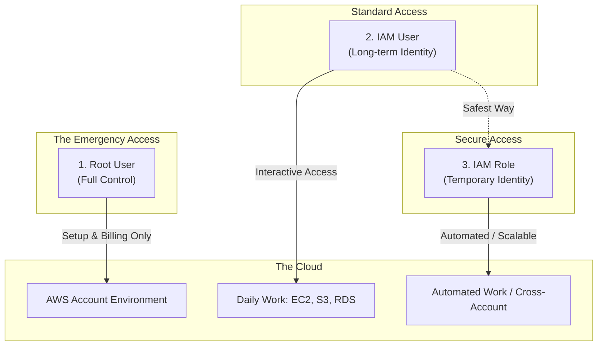
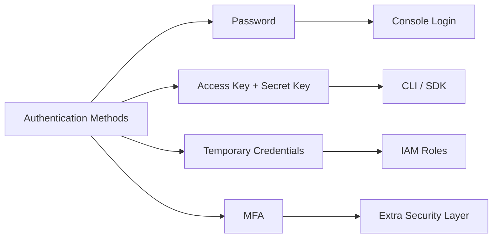
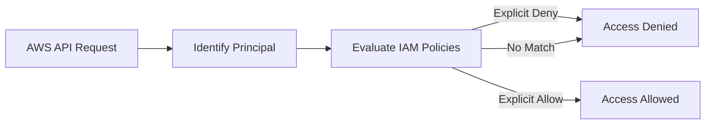
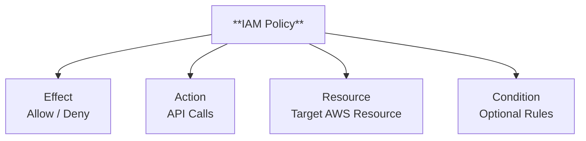
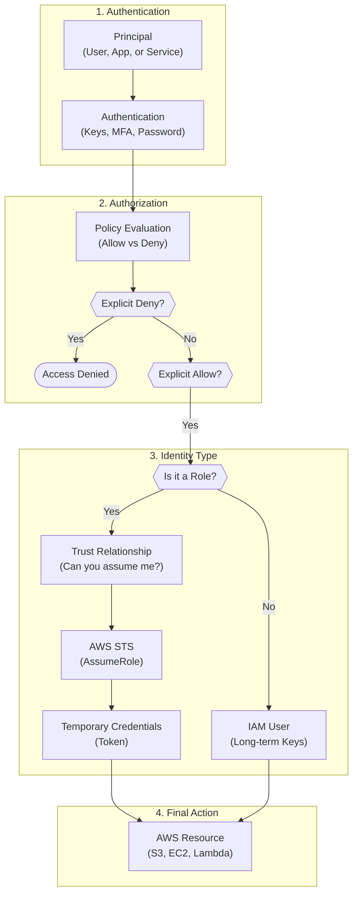

# AWS IAM

Think of IAM as **“Who can do *what*, on *which* AWS resources, and *how securely*.”**

---

## 1. Identity

Before permissions, AWS needs to know **who you are ? **

### IAM Identities

There are of **three** types:
1. Root User
2. IAM User
3. IAM Role


> Root user only for account setup → everything else uses IAM.

---

## 2. Authentication

Authentication answers: **“Are you really who you say you are?”**

### Methods

> Authentication happens **before** authorization.

---

## 3. Authorization via Policies

After AWS **authenticates** an identity, it performs **authorization** to decide:

**“Is this identity allowed to perform this action on this resource ? ”**

Authorization in AWS is entirely controlled by **IAM Policies**.

## Authorization Flow


---

### One-Line Memory Hook

> **No policy = No access.

> Deny beats allow.

> Authorization happens on every request.

---

## 4. IAM Policies

Everything in IAM revolves around policies !

### What is a Policy?

A **JSON document** that defines permissions.

```json
{
  "Effect": "Allow",
  "Action": "ec2:StartInstances",
  "Resource": "*"
}
```

### Policy Structure :


---

### Types of Policies (ORDER MATTERS)

| Policy Type                  | Attached to                |
| ---------------------------- | -------------------------- |
| **1. AWS Managed**           | Users, roles               |
| **2. Customer Managed**      | Users, roles               |
| **3. Inline Policy**         | One identity only          |
| **4. Resource-Based Policy** | Resource (S3, SQS, Lambda) |

---

## 5. IAM Users

### What is an IAM User?

* Represents **a person or application**
* Has **long-term credentials**
* Uses **policies** for permissions

### Best Practices

* ✔ One user = one human
* ✔ No shared users
* ❌ Avoid access keys if possible

> IAM users are **NOT scalable** for automation → roles are better.

---

## 6. MFA

**Multi-Factor Authentication**

Its Adds extra layer of protection :

* Something you **know** (password)
* Something you **have** (OTP / device)

### Where MFA is used?

| Identity  | MFA use            |
| --------- | ------------------ |
| Root user | Mandatory          |
| IAM user  | Highly recommended |
| Role      | Not directly       |

> 📌 MFA protects against **credential leaks**

---

## 7. IAM Roles (Temporary Identity — MOST IMPORTANT)

This is where IAM becomes powerful 💥

### What is a Role?

* **No username**
* **No password**
* Uses **temporary credentials**
* Assumed by someone or something

### Who can assume a role?

* IAM User
* AWS Service (EC2, Lambda)
* Another AWS account
* External identity (OIDC, SAML)

---

## 8. Trust Relationship (WHO can assume the role?)

A role has **two policies**:

### 1. Trust Policy (WHO)

```json
{
  "Effect": "Allow",
  "Principal": {
    "Service": "ec2.amazonaws.com"
  },
  "Action": "sts:AssumeRole"
}
```

➡ Defines **who is allowed to assume the role**

### 2. Permission Policy (WHAT)

Defines what the role can do *after being assumed*

📌 **Trust policy ≠ permission policy**

---

## 9️. Assume Role Flow (CRITICAL)

Let’s break it simply:

```
User / Service
    ↓
AssumeRole (STS)
    ↓
Temporary Credentials
    ↓
Access AWS Resources
```

### Why assume roles?

✔ No permanent keys
✔ Auto-rotated credentials
✔ Least privilege
✔ Cross-account access

---

## 10. Cross-Account Access (Multi-Account IAM)

Used in **real production setups**.

### Scenario

Account A → wants to access → Account B resources

### How it works:

1️. Role created in **Account B**
2️. Trust policy allows **Account A**
3️. User in A assumes role in B
4️. Temporary credentials issued

📌 No access keys shared 🔥

---

## 11. Cross-Cloud / External Access (OIDC / SAML)

Used when:

* GitHub Actions
* Kubernetes (EKS)
* Azure / GCP identities

### Example:

GitHub → AWS

```
GitHub OIDC
    ↓
AWS STS
    ↓
IAM Role
    ↓
AWS Access
```

✔ No secrets stored
✔ Industry best practice

---

## 12. IAM Evaluation Logic (FINAL UNDERSTANDING)

When a request comes in:

1️. Is the identity authenticated?
2️. Is there an **explicit DENY**? → X
3️. Is there an **explicit ALLOW**? → ✅
4️. Else →  (implicit deny)

 **Implicit deny is default**

---

## Final Mental Model (Remember This)

> **IAM = Identity + Policy + Trust + Security**

| Concept       | Answers              |
| ------------- | -------------------- |
| User          | Who (permanent)      |
| Role          | Who (temporary)      |
| Policy        | What                 |
| Trust Policy  | Who can assume       |
| MFA           | Extra security       |
| STS           | Temporary access     |
| Cross-account | Secure multi-account |
| OIDC/SAML     | External access      |

---


---
